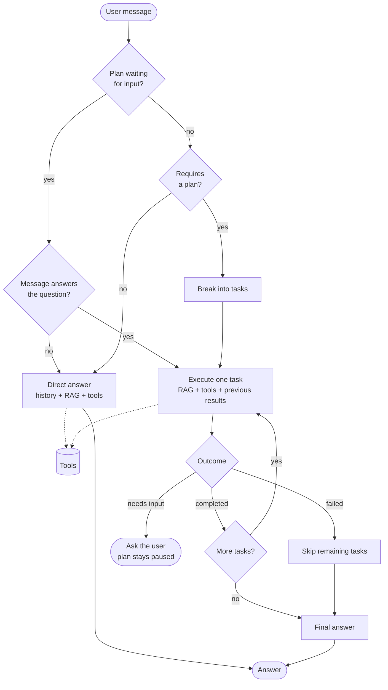

# HR Policy Agent

A conversational HR agent that answers questions about internal company policies
(vacation, equipment, equity, remote work, compliance, and more).

Policies are stored in MongoDB Atlas as vector embeddings. When a user asks something, the agent
retrieves the most relevant documents by semantic similarity (RAG) and answers using **only** those
documents as the source of truth — it never makes rules up.

Conversation history also lives in MongoDB and is automatically compacted by a custom advisor
(`MessageCompactingAdvisor`) once it grows too large, so the prompt never blows past the token limit.

When a request needs more than an answer — "request my vacation and email my manager" — the agent
breaks it into a plan, executes one task at a time using tools, and pauses to ask the user whenever
a task is missing information. The plan is stored in MongoDB, so it survives between messages.


## Stack

| Layer | Technology |
|---|---|
| Language | Java 21 |
| Database | MongoDB Atlas |
| Memory & summarization | `MessageCompactingAdvisor` |

## Flow

**Startup:** `PolicySeedConfig` → `policy_kb` empty? → embed ~16 HR policies → done (idempotent)

Every message enters through `AgentService`, which decides between two paths: answer directly, or
break the request into a plan and execute it task by task.



### The decision

`chatClientPlanDecision` classifies the message. A single question ("when do I become eligible?")
is answered directly. A sequence of actions ("request my vacation and email my manager") becomes a
plan, stored in the `plan` collection with one `Task` per step.

Each task is executed on its own by `chatClientPlanExecution`, which receives the original user
message, the plan goal, the results of the tasks already completed, and everything the user has
answered so far. It returns a `TaskExecution` — `success`, `needsUserInput` and the `output` — and
that verdict drives the task status:

| Outcome | Task status | What happens |
|---|---|---|
| Achieved | `COMPLETED` | The result feeds the next task |
| Missing user data | `WAITING_INPUT` | The plan pauses and the output becomes a question |
| Missing system or tool | `FAILED` | Remaining tasks are marked `SKIPPED` |

A paused plan survives in MongoDB between turns. On the next message, `chatClientInputClassification`
checks whether the user actually answered the pending question — a counter-question is answered on
its own and the plan stays paused, instead of being consumed as an answer.

### Tools

Tools are the only source for data about the employee; the policy documents are the source for the
rules. Both the direct-answer client and the task executor share the same tools, so the agent never
knows something on one path and ignores it on the other.

| Tool | Returns |
|---|---|
| `getVacationBalance` | Available vacation days |
| `checkVacationAvailability` | Whether a start date and duration are allowed |
| `submitVacationRequest` | A request id with `PENDING_APPROVAL` |
| `getManager` / `getTeamMembers` | Contacts of the employee |
| `sendEmail` | A message id with `SENT` |

The current date is **not** a tool: it is injected into the system prompt on every request
(`current_date`), because a deterministic value should never depend on the model deciding to look
it up.

### Memory

| Layer | Where it lives | What it holds |
|---|---|---|
| Working memory | `MessageWindowChatMemory` over `MongoChatMemoryRepository` | Recent turns, capped by `max-messages` |
| Compacted memory | `MessageCompactingAdvisor` → `summary_conversation` | A running summary, rewritten when the window passes `max-tokens` |
| Agent state | `plan` collection | Tasks, statuses, results and user inputs of a paused plan |
| Knowledge | `policy_kb` vector store | HR policies, retrieved by similarity |

The first two follow the conversation; the third is what lets the agent stop mid-plan, ask a
question, and pick up where it left off on a later message.

### Endpoints

| Method | Route | Description |
|---|---|---|
| `POST` | `/api/chat` | Send a message and get the agent's answer |
| `GET` | `/api/chat` | List existing conversations |
| `GET` | `/api/chat/{conversationId}` | Return a conversation's history |
| `DELETE` | `/api/chat/{conversationId}` | Delete a conversation |

Example request:

```json
POST /api/chat
Content-Type: application/json

{
  "message": "If I leave the company, can I keep the laptop?",
  "conversationId": "001"
}
```

## How to run

### Prerequisites

- **Java 21** installed (`java -version`)
- A **MongoDB Atlas cluster** (the free M0 tier works) with Vector Search available
- An **OpenAI API key**

### Step 1 — Clone and enter the project

```bash
git clone <repo-url>
cd policyAgent
```

### Step 2 — Export the environment variables

`application.yml` expects two variables. Without them the application will not start.

```bash
export MONGODB_URI="mongodb+srv://<user>:<password>@<cluster>.mongodb.net/?retryWrites=true&w=majority"
export OPENAI_API_KEY="sk-..."
```

| Variable | Required | Purpose |
|---|---|---|
| `MONGODB_URI` | Yes | Atlas connection string (chat history + vector store) |
| `OPENAI_API_KEY` | Yes | Chat completions and embedding generation |

### Step 3 — Run the application

```bash
./mvnw spring-boot:run
```

Or package it first, if you prefer:

```bash
./mvnw clean package
java -jar target/policyAgent-0.0.1-SNAPSHOT.jar
```

The `policy_agent` database, the `policy_kb` collection, and the `vectorstore_index` index are
created automatically (`initialize-schema: true`), and the policies are ingested on the first
startup.

### Step 4 — Talk to the agent

**From the browser:**

```
http://localhost:8080
```

**From the terminal:**

```bash
curl -X POST http://localhost:8080/api/chat \
  -H "Content-Type: application/json" \
  -d '{"message":"When can I take vacation?","conversationId":"001"}'
```

Good questions to try:

- "When can I take vacation?"
- "If I leave the company, can I keep the laptop?"
- "Can I sell my shares whenever I want?"
- "I forgot to log my hours, what should I do?"

> There is also a ready-to-use file at `src/main/resources/http/policy.http` that you can run
> straight from IntelliJ or VS Code.
