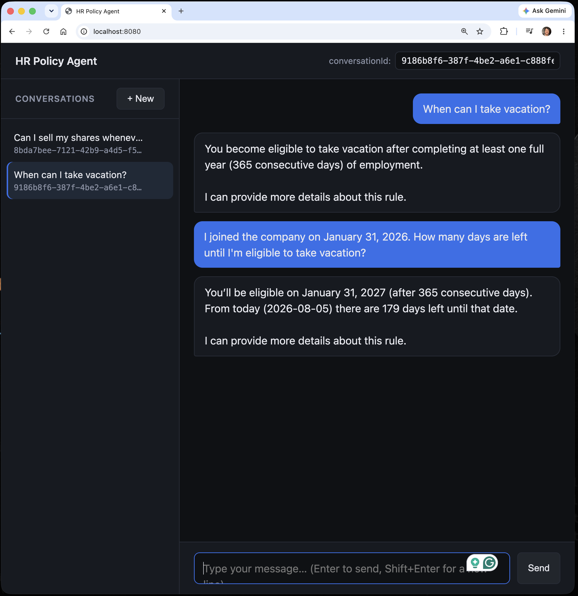

# HR Policy Agent

A conversational HR agent that answers questions about internal company policies
(vacation, equipment, equity, remote work, compliance, and more).

Policies are stored in MongoDB Atlas as vector embeddings. When a user asks something, the agent
retrieves the most relevant documents by semantic similarity (RAG) and answers using **only** those
documents as the source of truth — it never makes rules up.

Conversation history also lives in MongoDB and is automatically compacted by a custom advisor
(`MessageCompactingAdvisor`) once it grows too large, so the prompt never blows past the token limit.



## Stack

| Layer | Technology |
|---|---|
| Language | Java 21 |
| Database | MongoDB Atlas |
| Memory & summarization | `MessageCompactingAdvisor` |

## Flow

**Startup:** `PolicySeedConfig` → `policy_kb` empty? → embed ~16 HR policies → done (idempotent)

**Per question:** `MessageCompactingAdvisor` (summarize history if too long) → `MessageChatMemoryAdvisor` (load history) → `QuestionAnswerAdvisor` (Atlas Vector Search) → OpenAI answers within `AgentConfig.PROMPT_TEMPLATE` → persist in MongoDB

### Endpoints

| Method | Route | Description |
|---|---|---|
| `POST` | `/api/chat` | Send a message and get the agent's answer |
| `GET` | `/api/chat` | List existing conversations |
| `GET` | `/api/chat/{conversationId}` | Return a conversation's history |
| `DELETE` | `/api/chat/{conversationId}` | Delete a conversation |

Example request:

```json
POST /api/chat
Content-Type: application/json

{
  "message": "If I leave the company, can I keep the laptop?",
  "conversationId": "001"
}
```

## How to run

### Prerequisites

- **Java 21** installed (`java -version`)
- A **MongoDB Atlas cluster** (the free M0 tier works) with Vector Search available
- An **OpenAI API key**

### Step 1 — Clone and enter the project

```bash
git clone <repo-url>
cd policyAgent
```

### Step 2 — Export the environment variables

`application.yml` expects two variables. Without them the application will not start.

```bash
export MONGODB_URI="mongodb+srv://<user>:<password>@<cluster>.mongodb.net/?retryWrites=true&w=majority"
export OPENAI_API_KEY="sk-..."
```

| Variable | Required | Purpose |
|---|---|---|
| `MONGODB_URI` | Yes | Atlas connection string (chat history + vector store) |
| `OPENAI_API_KEY` | Yes | Chat completions and embedding generation |

### Step 3 — Run the application

```bash
./mvnw spring-boot:run
```

Or package it first, if you prefer:

```bash
./mvnw clean package
java -jar target/policyAgent-0.0.1-SNAPSHOT.jar
```

The `policy_agent` database, the `policy_kb` collection, and the `vectorstore_index` index are
created automatically (`initialize-schema: true`), and the policies are ingested on the first
startup.

### Step 4 — Talk to the agent

**From the browser:**

```
http://localhost:8080
```

**From the terminal:**

```bash
curl -X POST http://localhost:8080/api/chat \
  -H "Content-Type: application/json" \
  -d '{"message":"When can I take vacation?","conversationId":"001"}'
```

Good questions to try:

- "When can I take vacation?"
- "If I leave the company, can I keep the laptop?"
- "Can I sell my shares whenever I want?"
- "I forgot to log my hours, what should I do?"

> There is also a ready-to-use file at `src/main/resources/http/policy.http` that you can run
> straight from IntelliJ or VS Code.
