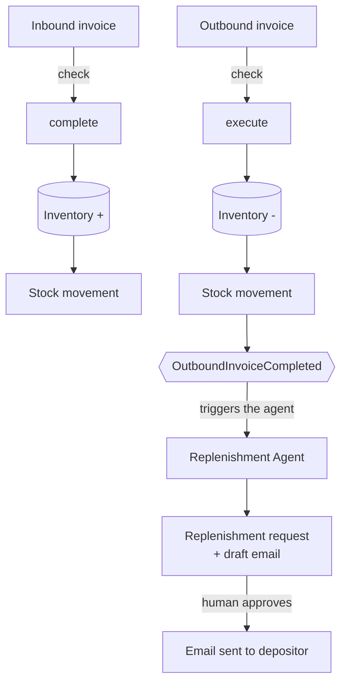

# Agentic WMS

A simple Warehouse Management System that handles **inbound**, **outbound** and **replenishment** — with an AI agent that decides on its own when stock needs to be replenished.

**Live demo:** [mdb.link/agentic-wms](https://mdb.link/agentic-wms)
## How it works

The **Overview** tab in the app shows this same flow, tracks how far you got and links to each step.

Inbound and outbound follow the same three steps: create the invoice, check it, then confirm it. Confirming is what actually moves stock.



## Who triggers the agent

Nobody. There is no "run agent" button.

Completing an outbound invoice (`POST /outbound-invoice/{number}/execute`) publishes an
`OutboundInvoiceCompleted` event after the transaction commits. `ReplenishmentAnalysisListener`
picks it up asynchronously and runs the agent.

The agent then plans and executes its own tasks, picking one capability per task:

| Capability | What it does |
|---|---|
| `ANALYSIS` | Reads inventory and stock movements. Read-only. |
| `POLICY` | Reads the depositor's rules — minimum quantity, lead time, blackout periods. |
| `DECISION` | Decides whether replenishment is actually needed. Uses no tool. |
| `REPLENISHMENT` | Creates a replenishment request that complies with the policies. |
| `NOTIFICATION` | Drafts the notification email for the depositor. |

The agent stops there. It drafts the email but never sends it — a human approves the
replenishment (`POST /replenishment/{id}/status/{status}`), and only then the notification goes out.

Depositor policies are plain text stored in MongoDB and retrieved by **vector search**, so the
agent finds the relevant rule by meaning rather than by an exact key.

## Stack

- **Java 25** + **Spring Boot 4.1**
- **Spring AI 2.0** — chat, tool calling and chat memory
- **OpenAI `gpt-4.1`** for reasoning
- **Voyage AI** for embeddings
- **MongoDB Atlas** — operational data, chat memory and Atlas Vector Search, in the same database
- **Bucket4j** for rate limiting
- **Docker** on **Google Cloud Run**

## Running locally

```bash
export MONGODB_URI="mongodb+srv://..."
export OPENAI_BASE_URL="..."
export GROVE_API_KEY="..."
export VOYAGE_BASE_URL="..."
export VOYAGE_API_KEY="..."

mvn spring-boot:run
```

Then open http://localhost:8080.

Sample requests for every endpoint live in `src/main/resources/http`.

## Demo limits

The live demo is open to anyone, so usage is capped in `application.yaml`:

```yaml
wms:
  limits:
    enabled: true
    per-ip-requests-per-minute: 10
    global-requests-per-day: 100
    agent-runs-per-day: 50
    max-policy-text-length: 2000
```

Set `LIMITS_ENABLED=false` to turn it off while developing.
