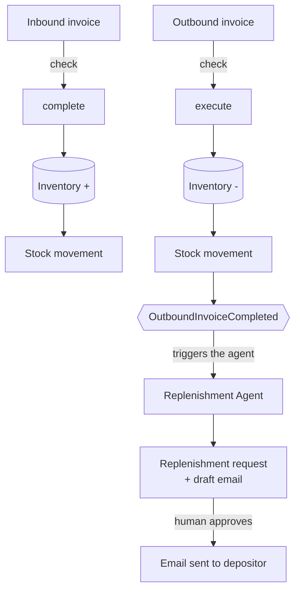

# Agentic WMS

A simple Warehouse Management System that handles **inbound**, **outbound** and **replenishment** — with an AI agent that decides on its own when stock needs to be replenished.

You can read more on:
- [Building an Agentic Warehouse Management System — Part 1: Where AI Agents Add Value](https://foojay.io/today/building-an-agentic-warehouse-management-system-part-1-where-ai-agents-add-value/).
- [Building an Agentic Warehouse Management System — Part 2: Java and Spring AI](https://foojay.io/today/building-an-agentic-warehouse-management-system-part-2-java-and-spring-ai/).
- [Building an Agentic Warehouse Management System — Part 3: Tools, Decisions, and Actions](https://foojay.io/today/building-an-agentic-warehouse-management-system-part-3-tools-decisions-and-actions/).

Wanna try the application?
- **Live demo:** [mdb.link/agentic-wms](https://mdb.link/agentic-wms)

## How it works

The **Overview** tab in the app shows this same flow, tracks how far you got and links to each step.

Inbound and outbound follow the same three steps: create the invoice, check it, then confirm it. Confirming is what actually moves stock.



## The agent

Nobody triggers it. There is no "run agent" button — completing an outbound invoice does it:

```
outbound completed
        ↓
   ANALYSIS      → reads inventory and stock movements
        ↓
   POLICY        → reads the depositor's rules (vector search)
        ↓
   DECISION      → replenishment needed?
        ↓
   REPLENISHMENT → creates the request
        ↓
   NOTIFICATION  → drafts the email
        ↓
   human approves → email sent
```

The agent stops at the draft. Only a human approval actually sends the email.

## Stack

- **Java 25** + **Spring Boot 4.1**
- **Spring AI 2.0** — chat, tool calling
- **OpenAI `gpt-4.1`** for reasoning
- **Voyage AI** for embeddings
- **MongoDB Atlas** Vector Database
- **Bucket4j** for rate limiting
- **Docker** on **Google Cloud Run**

## Running it

You need a MongoDB Atlas cluster, an OpenAI key and a Voyage AI key.

```bash
export MONGODB_URI="mongodb+srv://..."
export OPENAI_API_KEY="sk-..."
export VOYAGE_BASE_URL="https://api.voyageai.com/v1"
export VOYAGE_API_KEY="pa-..."

mvn spring-boot:run
```

Open http://localhost:8080. 
